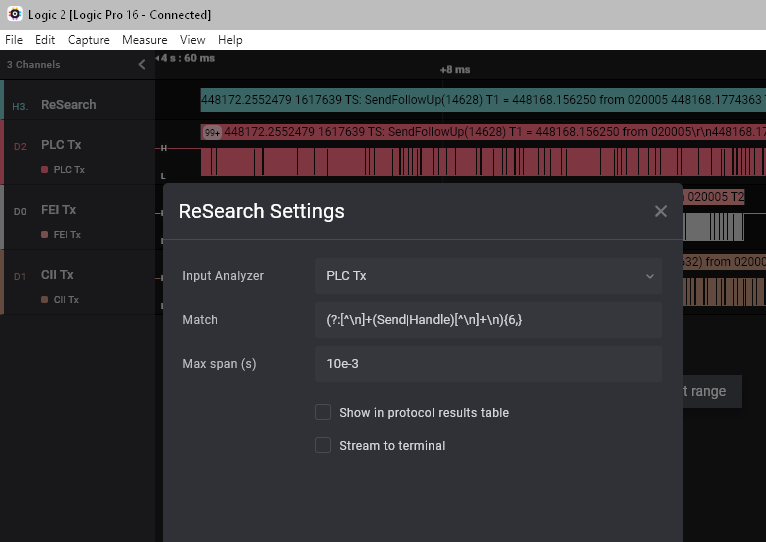

# Re Search

**Re Search** is a Logic2 extension that adds searches for text matching a given
regular expression in textual output from low level analyzers and outputs the
matched text.

This is a useful tool for finding data of interest generated by various LLAs and
quickly navigating between matches using Logic's skip facilities.

At present the Async Serial LLA is supported and the I2C LLA is mostly
supported.

## Instructions

Install **ReSearch** by clicking "Install" on the **Re Search** entry in the
Extensions panel.

Use the Analyzers side panel to add a Re Search analyzer.

In the ReSearch Settings dialog select the LLA. At present the Async Serial
analyzer is well supported. I2C partial support has been added, but is not
thoroughly tested. Support for other LLAs may be added in the future.

### Match

Use the Match setting to set teh regular expression. Python regular expression
syntax is used for the match string. Note that the provided match is not checked
for syntax errors (a badly formed string will generate a somewhat cryptic error
dialog in Logic!).

Note that trailing wild card matches are generally not useful as the match is
performed when each character is added to the target string. For example, `fox.*`
will match `fox`, at which point all characters up to and including `fox` will
be dropped. Anchor the end of the expression with a non-wild pattern. Often a
positive look ahead match (`(?= ...)`) is useful as an anchor.

### Max span (s)

Use the **Max span (s)** setting to specify the maximum width in seconds allowed
for a match. This can be used to match only within a block of text when there is
significant time between blocks for example. It also makes the matching process
run faster because it can ignore anything that is too old.

Setting **Max span (s)** to `0` or leaving it blank turns this feature off.

## Data Rendering

Data is rendered depending on the LLA type and the frame type.

### Async Serial

**frame.data["data"]** bytes are rendered as ASCII if their value is `<= 127`
and `>= 32`. For other values Python's `hex()` function is used and a space is
appended.

**frame.data["address"]** if present and True renders frame.data as a byte using
`hex()` and appends a space and preceeded by @.

**frame.data["error"]** is ignored.

### I2C

#### Frame Type: "address"

**frame.address["address"]** is rendered as a hex value with a space appended
and preceded by @.

Other **frame.address** fields are not currently decoded.

**frame.data["data"]** is rendered as a hex value with a space is appended.

Other **frame.data** fields are not currently decoded.

**frame.start** is ignored.

**frame.stop** triggers a match attempt. This allows a trailing `.*` to match
all of the transaction following an address match.

